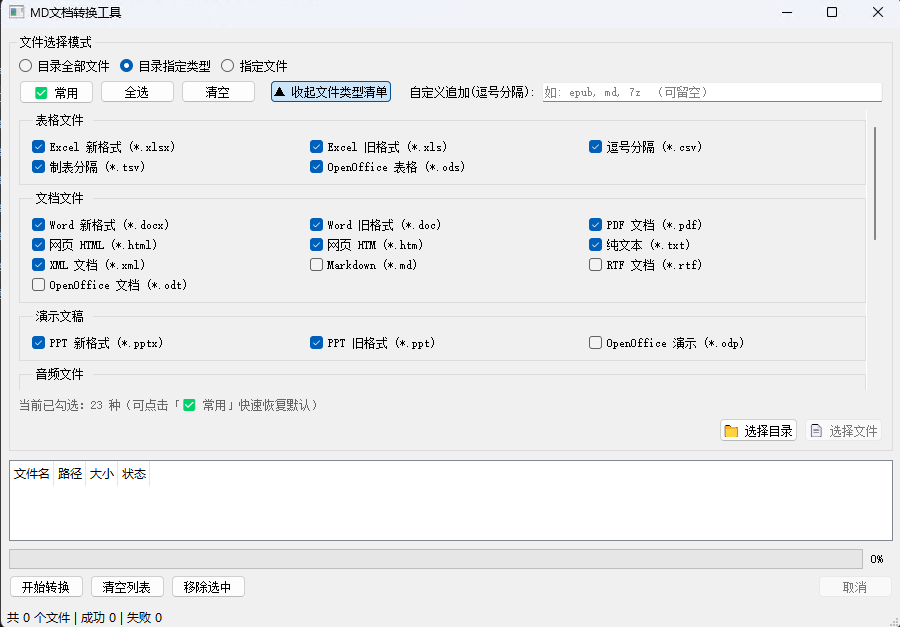
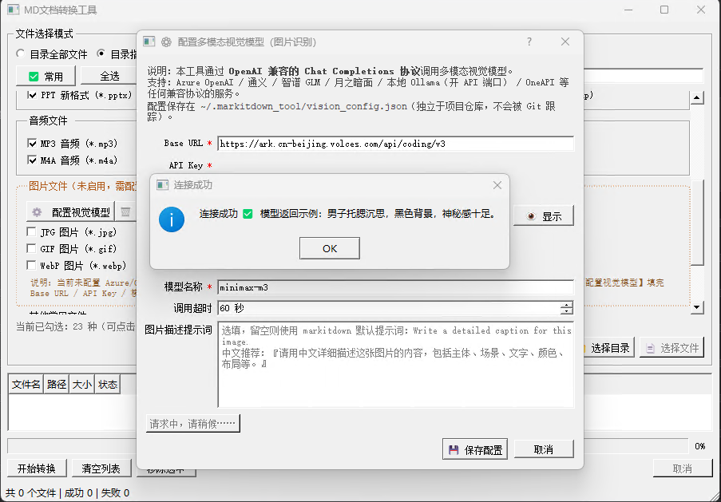

# MD文档转换工具 v1.1.3

<p align="left">
  <a href="https://github.com/HelloMasonC/md-doc-converter/stargazers">
    
  </a>
  <a href="https://github.com/HelloMasonC/md-doc-converter/forks">
    
  </a>
  <a href="https://github.com/HelloMasonC/md-doc-converter/blob/master/README.md#L351-L353">
    
  </a>
  <a href="https://github.com/HelloMasonC/md-doc-converter/releases">
    
  </a>
  <a href="#">
    
  </a>
  <a href="#">
    
  </a>
  <a href="https://github.com/microsoft/markitdown">
    
  </a>
</p>

<p align="left">
  <a href="https://github.com/HelloMasonC/md-doc-converter/releases/latest">
    
  </a>
    
  <a href="https://github.com/HelloMasonC/md-doc-converter/releases">
    
  </a>
</p>

<!-- ===== 主界面截图占位区：等你把 screenshot-main.png 丢进 assets 目录就自动显示了 ===== -->

<p align="center">
  
</p>
<blockquote>
  <p>👆 （截图占位：请将工具主界面截图保存为 <code>assets/screenshot-main.png</code> 即可在此处显示；推荐截取「文件类型清单」已展开状态，包含 6 大类复选框 + 图片分类橙色虚线框 + ⚙️ 配置视觉模型按钮，效果最佳）</p>
</blockquote>
<!-- ===== 截图占位区结束 ===== -->

---

基于微软开源 [MarkItDown](https://github.com/microsoft/markitdown) 与 **PyQt5** 开发的 Windows 桌面 GUI 工具，支持将多种文档格式批量转换为标准 Markdown。
**新增视觉模型配置入口**：图片文件（jpg/png/webp 等）只要填好 OpenAI 兼容接口的 Base URL / API Key / 模型名，就能立即识别图片内容并生成描述文本。

> 「文档转 Markdown，so easy！图片也能看懂内容——只要你有 Key！」

---

## ✨ 核心功能

| 功能                         | 说明                                                                                                                                                           |
| ---------------------------- | -------------------------------------------------------------------------------------------------------------------------------------------------------------- |
| 📁**三种文件选择模式** | 目录全部文件 / 目录指定类型（6 大类 40 种格式复选框清单，支持常用/全选/清空/展开·收起，可自定义追加扩展名）/ 单/多文件选择                                    |
| 🔄**批量转换**         | 一次性处理多个文件，支持中断取消                                                                                                                               |
| 📝**Markdown 输出**    | 默认输出到源文件同目录、同名，扩展名为`.md`                                                                                                                  |
| 📊**实时进度**         | 进度条 + 状态栏 + 表格逐行状态标记（待转换/转换中/成功/失败）                                                                                                  |
| 🛡️**错误处理**       | 单文件失败不中断整批流程，失败行标红 + 悬停查看错误原因                                                                                                        |
| 🛠️**覆盖策略**       | 同名`.md` 已存在时，一次性弹窗选择「全部覆盖 / 全部跳过 / 取消」                                                                                             |
| 🎵**音频自动支持**     | `.mp3 / .wav / .m4a / .flac / .ogg` 开箱即用（已通过 imageio-ffmpeg 内置静态编译版 ffmpeg，无需单独安装）                                                    |
| 🖼️**图片识别可启用** | 主界面图片分类区提供`⚙️ 配置视觉模型…` 按钮，填 OpenAI 兼容接口（Base URL / API Key / 模型名，可自定义 Prompt）即可立即生效；配置前默认仅提取 EXIF 元数据 |
| 🔑**配置本地持久化**   | 视觉模型配置保存在`~/.markitdown_tool/vision_config.json`（独立于仓库，不进 Git），支持一键清除                                                              |

---

## 📋 支持的文件类型

| 类别     | 扩展名                                                                                                                                                                                       |
| -------- | -------------------------------------------------------------------------------------------------------------------------------------------------------------------------------------------- |
| 表格     | `.xlsx` / `.xls` / `.csv` / `.tsv` / `.ods`                                                                                                                                        |
| 文档     | `.docx` / `.doc` / `.pdf` / `.html` / `.htm` / `.txt` / `.xml` / `.md` / `.rtf` / `.odt`                                                                                 |
| 演示文稿 | `.pptx` / `.ppt` / `.odp`                                                                                                                                                              |
| 音频     | `.mp3` / `.wav` / `.m4a` / `.flac` / `.ogg`（✅ 已内置 ffmpeg，开箱即用，无需单独安装）                                                                                            |
| 图片     | `.jpg` / `.jpeg` / `.png` / `.gif` / `.bmp` / `.tiff` / `.webp`（⚡ 默认仅提取 EXIF 元数据；**填好视觉模型配置即可真正"看懂图片"**，下面「启用图片识别」章节有操作指南） |
| 其他常见 | `.json` / `.yaml` / `.yml` / `.zip` / `.rar` / `.7z` / `.ini` / `.toml` / `.log` / `.eml`                                                                                |

> 具体支持范围以 [MarkItDown 官方文档](https://github.com/microsoft/markitdown) 为准。

---

## 🖼️ 启用图片识别（视觉多模态模型，可选）

本工具图片分类区**默认显示为橙色虚线「未启用」**，此时勾选图片只会提取 EXIF 元数据（尺寸/时间/GPS 等），不会真的"看懂图片"。
只要你手上有任意 **OpenAI Chat Completions 兼容协议**的多模态接口（例如 Azure OpenAI / 通义千问视觉 / 智谱 GLM-4V / 月之暗面 / 本地 Ollama + API / OneAPI 聚合层……），填 3 项就能立刻启用：

1. 打开主界面 → 展开「文件类型清单」→ 找到橙色虚线的 **图片文件** 分类
2. 点击右上角 **⚙️  配置视觉模型…** 按钮 → 弹出配置窗口：

   <p align="center">
     
   </p>

   | 字段           | 示例                                                                                                 | 必填 |
   | -------------- | ---------------------------------------------------------------------------------------------------- | ---- |
   | Base URL       | `https://api.openai.com/v1` 或 `https://dashscope.aliyuncs.com/compatible-mode/v1`               | ✅   |
   | API Key        | `sk-xxxxxxxxxxxxxxxx`（支持「👁 显示」切换明文查看）                                               | ✅   |
   | 模型名称       | `gpt-4o-mini` / `qwen-vl-plus` / `glm-4v-flash` 等                                             | ✅   |
   | 图片描述提示词 | 留空用 markitdown 默认；中文推荐：`请用中文详细描述这张图片，包括主体、场景、文字、颜色、布局等。` | 可选 |
   | 调用超时       | 默认 60 秒，慢接口可调高                                                                             | 可选 |
3. 推荐先点 **🧪 测试连接（用 1x1 小图发一次真实请求）** 冒烟测一次，成功会返回一句模型示例描述
4. 点 **💾 保存配置** → 图片框立刻变成**绿色实线「✅ 已启用 · 模型 xxx」**，下次启动自动生效，不用再填

配置文件保存在 `~/.markitdown_tool/vision_config.json`（用户主目录下），不会被 Git 跟踪，也不用重启程序。
想还原"未启用"状态？点图片框里的 `🗑 清除本地配置` 即可（不会删任何代码）。

---

## 💻 环境要求

- **操作系统**：Windows 10 / 11
- **Python 版本**：Python 3.9 及以上（建议 3.10 / 3.11）
- **推荐工具** ⭐：[uv](https://github.com/astral-sh/uv)（Astral 出品，比 venv + pip 快 10~100 倍）
- **依赖库**：
  - `PyQt5>=5.15`（GUI 框架）
  - `markitdown[all]`（转换引擎，含 pydub / pandas / SpeechRecognition 等全部转换器）
  - `imageio-ffmpeg>=0.5`（自带 Windows / macOS / Linux 静态编译版 ffmpeg，音频转写零配置）
- **Python 标准库**：视觉（图片识别）HTTP 客户端**只用了 `urllib.request`**，不额外引入 openai / httpx 依赖，减少打包体积
- **可选**：无需再装 ffmpeg（imageio-ffmpeg 已内置）；如遇特殊格式，系统里的 ffmpeg 优先级低于内置版

---

## 🚀 快速开始

> 💎 **新手推荐**：直接下载已打包好的单文件 exe，不用装 Python，双击即用（见下面「方式零」）。

---

### 方式零：直接使用 exe 便携版（零配置，适合 99% 的同学）⭐⭐

不用装 Python / 不用敲命令 / 拷到 U 盘就能跑。

1. **获取 exe**：项目仓库发布页（Releases）下载 exe（Release 资产文件名为 `md-doc-converter.exe`，下载后可自行重命名，不影响使用）。
2. **双击 exe 启动**即可使用。

> ⚠️ **小提醒**：
>
> - 首次启动会慢几秒（单文件模式先自解压到临时目录 + 加载内置 ffmpeg），属正常现象
> - 若杀毒软件误报请加白名单（PyInstaller 打包的常见情况）
> - **音频（mp3/wav/m4a 等）直接支持**：ffmpeg 静态编译版已通过 imageio-ffmpeg 一起打进去了，不用再单独装 ffmpeg
> - **图片识别可选启用**：首次启动默认「未启用」，在主界面图片分类区点 `⚙️  配置视觉模型…`，填完 Base URL / API Key / 模型名 3 项立刻启用，配置保存在本机 `~/.markitdown_tool/vision_config.json`

---

### 方式一：开发者模式 · uv 命令行（速度最快）⭐

```powershell
# 1. 进入项目目录
cd md-doc-converter

# 2. 创建虚拟环境（毫秒级，自动选择合适的 Python 版本）并激活
uv venv .venv
.venv\Scripts\activate

# 3. 安装依赖（高速并发下载 + 全局缓存，比 pip 快 10~100 倍）
uv pip install -r requirements.txt
# 如需加速国内网络：
# uv pip install --index-url https://pypi.tuna.tsinghua.edu.cn/simple -r requirements.txt
# 或逐个安装：
# uv pip install "PyQt5>=5.15" "markitdown[all]"

# 4. 启动程序
uv run main.py
```

> 还没装 uv？三选一：
>
> ```powershell
> # 推荐：官方脚本一键安装
> powershell -ExecutionPolicy ByPass -c "irm https://astral.sh/uv/install.ps1 | iex"
> # winget
> winget install astral-sh.uv
> # 用 pip 临时装一下
> pip install uv
> ```

---

### 方式二：原生 venv + pip（兼容性最好，速度较慢）

```bash
# 1. 进入项目目录
cd md-doc-converter

# 2. 创建并激活虚拟环境
python -m venv .venv

# Windows cmd 激活：
.venv\Scripts\activate.bat
# PowerShell 激活：
# .venv\Scripts\Activate.ps1

# 3. 安装依赖（国内建议加上镜像）
pip install -r requirements.txt
# 国内网络慢的话：
# pip install -i https://pypi.tuna.tsinghua.edu.cn/simple --trusted-host pypi.tuna.tsinghua.edu.cn -r requirements.txt

# 4. 启动程序
python main.py
```

> Python 三重回退提醒：找不到 `python` 命令时，试试 `py -3`（Windows 官方启动器）；
> 也可设置环境变量 `PYTHON` 指向你本机真实的 `python.exe` 完整路径。

---

## 🖱️ 使用说明

### 1. 选择文件（三种模式）

#### 模式 A：选择目录下全部文件

1. 选中顶部 **「目录全部文件」** 单选按钮
2. 点击 **「选择目录」** 按钮
3. 在弹出的目录对话框中选中目标目录，点击确认
4. 该目录下**所有文件**（不递归子目录）将自动加入转换列表

#### 模式 B：选择目录下指定类型（复选框清单，最常用）⭐

1. 选中顶部 **「目录指定类型」** 单选按钮
2. 点击 **▼ 展开文件类型清单** 面板 → 6 大类 **40 种** 格式勾勾选选即可：
   - 工具栏 4 个快捷按钮：「✅ 常用（默认 23 项）」/「全选」/「清空」/「展开·收起」
   - 底部实时汇总勾选数：`当前已勾选：23 种 + 自定义 N 种`
   - 特殊格式清单里没有？右上角 `自定义追加(逗号分隔)` 输入框兜底（比如填 `epub, azw3`）
3. **图片分类区**：
   - 橙色虚线框 = 未启用（仅提取 EXIF）；右上角 `⚙️ 配置视觉模型…` 填 3 项立刻启用 → 变成绿色实线 ✅
   - `🗑 清除本地配置` 一键还原（配置文件独立在 `~/.markitdown_tool/`，不污染仓库）
4. 点击 **「选择目录」** 按钮 → 系统仅扫描并添加匹配扩展名的文件

#### 模式 C：选择单个或多个文件

1. 选中顶部 **「指定文件」** 单选按钮
2. 点击 **「选择文件」** 按钮
3. 在弹出的文件对话框中，按住 `Ctrl` 可多选，按住 `Shift` 可区间选择
4. 确认后所选文件全部加入列表

> 💡 **提示**：重复添加同一文件会被自动去重，不会产生重复项。

---

### 2. 管理文件列表

| 操作                   | 按钮 / 方法                                          |
| ---------------------- | ---------------------------------------------------- |
| **移除选中项**   | 选中表格中一行或多行 → 点击**「移除选中」**   |
| **清空全部**     | 点击**「清空列表」**                           |
| **查看文件路径** | 表格「路径」列显示完整路径，长路径可拖动列宽查看     |
| **查看错误原因** | 转换后「失败」的文件，鼠标悬停到状态单元格可查看详情 |

---

### 3. 开始转换

1. 确认列表非空后，点击底部 **「开始转换」** 按钮
2. **同名文件冲突处理**：若目标 `.md` 文件已存在，系统会一次性弹窗提示：
   - **全部覆盖**：所有已存在的 `.md` 直接覆盖（推荐用于批量更新）
   - **全部跳过**：已存在的 `.md` 不处理，仅转换缺失的目标文件
   - **取消**：不启动转换，返回文件列表
3. 转换过程中：
   - 进度条按文件完成比例推进
   - 状态栏显示当前正在转换的文件名与「已完成/总数」
   - 表格中每行状态依次从「待转换」→「转换中」→「成功 / 失败」
   - 主窗口可拖动、缩放，**不会卡死**（转换运行在独立后台线程）
4. 中途需停止，点击 **「取消」** 按钮（当前正在转换的文件会处理完后停止）
5. 转换结束弹出统计摘要：

```
转换完成！
成功: 12 个
失败: 1 个
```

---

### 4. 查看输出

转换成功的 Markdown 文件默认保存在 **源文件所在的同一目录**，文件名保持一致、扩展名改为 `.md`：

```
原文件：D:\Docs\财务报表.xlsx
输出：  D:\Docs\财务报表.md
```

如需迁移所有 `.md`，可直接搜索目录下 `*.md` 批量移动。

---

## 📦 打包为 Windows EXE 便携版（开发者操作）

> 把程序打包成**单个 130MB 左右的 exe 文件**，发给别人、拷到别的电脑、丢到桌面都能直接用，**不需要对方安装 Python**。

### 前置准备（仅第一次需要）

先按照上面「方式一 / 方式二」把开发环境跑通一次（确认 `python main.py` 能正常启动）。然后在虚拟环境中装一下 PyInstaller：

```powershell
# uv 用户：
uv pip install pyinstaller

# 或 pip 用户：
pip install pyinstaller
```

### 打包命令（一条搞定）

```powershell
.venv\Scripts\python.exe -m PyInstaller --noconfirm --clean --onefile --windowed `
    --name "MD文档转换工具" `
    --collect-all magika `
    --collect-all markitdown `
    --collect-all imageio_ffmpeg `
    --collect-submodules app `
    main.py
```

关键参数说明：

| 参数                             | 作用                                                                                                                                                              |
| -------------------------------- | ----------------------------------------------------------------------------------------------------------------------------------------------------------------- |
| `--onefile`                    | 打包成**单个 exe 便携文件**（方便分发）                                                                                                                     |
| `--windowed`                   | 启动时**不弹黑色控制台窗口**（GUI 程序必备，干净清爽）                                                                                                      |
| `--collect-all magika`         | 把 magika 的 ONNX 模型 + 配置文件完整打包（少了这个 exe 在「判断文件类型」时会崩）                                                                                |
| `--collect-all markitdown`     | 把 markitdown 内部用到的各种转换器、数据文件都收进来（稳妥起见）                                                                                                  |
| `--collect-all imageio_ffmpeg` | ⭐ 把内置 ffmpeg 静态编译版一起打进去！**少了这个，exe 里音频转换（mp3/m4a 等）会因找不到 ffmpeg 报错**                                                     |
| `--collect-submodules app`     | 把本项目`app/` 下全部子模块一起收进来（新增的 `dialog_vision_settings`、`vision_client`、`config` 都是在运行时按需 import 的，不加可能报 ModuleNotFound） |
| `--clean --noconfirm`          | 每次干净打包，不询问覆盖                                                                                                                                          |

### 产物位置 + 使用

```
md-doc-converter/
├── build/                       # 中间产物（.gitignore 已忽略，不用管）
├── dist/
│   └── MD文档转换工具.exe         # ⭐ 这个就是你要的成品（约 230MB，含内置 ffmpeg）
└── MD文档转换工具.spec            # 打包配置（已纳入 Git，下次打包不用再输一长串命令）
```

**以后改了代码重新打包**，直接用 spec 文件更省事（前提是 spec 里也已经加了 imageio_ffmpeg 的 collect），
或者干脆每次都跑上面那条完整命令（最稳，不会忘记加参数）：

```powershell
.venv\Scripts\python.exe -m PyInstaller --noconfirm --clean "MD文档转换工具.spec"
```

> 💡 **v1.1.0 起新增模块提醒**：`app/config.py`、`app/vision_client.py`、`app/dialog_vision_settings.py` 是延迟加载/按需导入的（点击配置按钮时才 `from .dialog_vision_settings import ...`），PyInstaller 静态分析经常漏扫。**务必带上 `--collect-submodules app`**，否则 exe 点配置按钮直接报 `ModuleNotFoundError: No module named 'app.xxx'`。

### 打包后常见问题

| 现象                                                 | 解决                                                                                                                                                                                                    |
| ---------------------------------------------------- | ------------------------------------------------------------------------------------------------------------------------------------------------------------------------------------------------------- |
| exe 启动就报错「ModuleNotFoundError: xxx」           | 八成是少了依赖包的资源文件，在打包命令里补`--collect-all 包名` 后重打；**若是 app/ 自己的子模块（config / vision_client / dialog_vision_settings）报找不到，要补 `--collect-submodules app`** |
| 点「⚙️  配置视觉模型…」没反应 / 弹 ModuleNotFound | 打包漏了`--collect-submodules app` → 重打；或检查 `--collect-all markitdown` 是否也加上                                                                                                            |
| 音频转换报错"找不到 ffmpeg" / "ffprobe"              | 打包命令漏掉了`--collect-all imageio_ffmpeg` → 重打；或检查 spec 是否把 imageio_ffmpeg 的 binaries 收录了                                                                                            |
| 转换 .xlsx / .csv 时 pandas 相关报错                 | 参考经验：先确认开发环境`import pandas` 正常再打包；不要逐个手工补 `pandas._config.xxx`，优先 `--collect-all pandas` 批量收集                                                                     |
| 双击 exe 没反应，过一会消失                          | 通常是 DLL / 运行时缺失。临时做法：**先去掉 `--windowed` 重新打包**，运行时就能看到黑色控制台里的报错信息，定位到问题后再换回 `--windowed`                                                    |
| 杀毒软件报毒                                         | PyInstaller 打包的文件常被误报，加白名单 / 签名即可                                                                                                                                                     |

---

## 🌿 Git 提交说明

### 哪些要提交 ✅

| 文件 / 目录                                         | 原因                                                                                                                                                                         |
| --------------------------------------------------- | ---------------------------------------------------------------------------------------------------------------------------------------------------------------------------- |
| `main.py`、`app/`                               | 源代码，仓库核心（含`app/converter.py`、`app/ui_main.py`、`app/worker.py`，以及新增的 `app/config.py`、`app/vision_client.py`、`app/dialog_vision_settings.py`） |
| `requirements.txt`                                | 依赖清单，别人拉仓库后一键装环境                                                                                                                                             |
| `MD文档转换工具.spec`                             | **打包配置文件**，记录了 `--windowed` / `--collect-all magika` / `--collect-all imageio_ffmpeg` / `--collect-submodules app` 等关键参数                        |
| `README.md`、`docs/`、`MarkItDown使用说明.md` | 文档                                                                                                                                                                         |
| `.gitignore`                                      | 忽略规则本身（滑稽.jpg：告诉 Git 哪些东西不该管，这得被管）                                                                                                                  |
| `启动.bat`、`启动.ps1`（如果需要）              | 辅助脚本（可选，不推荐新手使用，但保留不占地方）                                                                                                                             |

### 哪些**坚决不要**提交 ❌

| 文件 / 目录                                   | 原因                                                                                                                          |
| --------------------------------------------- | ----------------------------------------------------------------------------------------------------------------------------- |
| `build/` ⭐                                 | PyInstaller 中间产物，每次打包都会重建，纯垃圾，放进来只会让仓库越来越大                                                      |
| `dist/` ⭐                                  | 打包输出的 exe。exe 是**派生文件**，可以用代码 + spec 重新生成，要分发请走「GitHub Releases / 网盘」而不是塞进 Git 仓库 |
| `.venv/` / `venv/`                        | 虚拟环境（几万个文件，拉仓库的人自己建就行）                                                                                  |
| `__pycache__/`、`*.pyc`                   | Python 字节码缓存，随时可生成                                                                                                 |
| `.vscode/`、`.idea/`                      | 个人 IDE 配置（每个人偏好不同，强制提交反而打架）                                                                             |
| `.markitdown_tool/`、`vision_config.json` | 视觉模型本地配置（如果误放到仓库根目录）—— 里面存着 API Key，**绝对不能入库**                                         |
| `*.log`、`*.tmp`、`*.bak`               | 日志和临时文件                                                                                                                |

### 快速自查

如果不确认当前状态，跑两条命令就一目了然：

```bash
# 1. 看暂存区里哪些文件被加进去了（有不该加的就 git reset HEAD <文件> 去掉）
git status

# 2. 看哪些规则没生效（比如 build/ 还在被追踪，就用 git rm -r --cached build/ 解除追踪）
git check-ignore -v build/MD文档转换工具/Analysis-00.toc
```

---

## 📂 项目结构

```
md-doc-converter/
├── main.py                    # 程序入口（高 DPI + PyQt5 缺失提示 + 视觉模型 client 注入）
├── requirements.txt           # 依赖：PyQt5、markitdown[all]、imageio-ffmpeg
├── 启动.bat                    # 辅助启动脚本（CMD 版，懂的同学可直接用，文档不推荐）
├── 启动.ps1                    # 辅助启动脚本（PowerShell 版，懂的同学可直接用，文档不推荐）
├── MarkItDown使用说明.md        # MarkItDown 官方用法参考
├── README.md                  # 本文件（v1.1.1 起，项目统一命名为「MD文档转换工具」）
├── .gitignore                 # Git 忽略规则（build、dist、.venv、.markitdown_tool、__pycache__ 等）
├── MD文档转换工具.spec         # PyInstaller 打包配置（含 --collect-all imageio_ffmpeg 等）
├── docs/                      # 文档目录
│   └── MarkItDown使用说明.md
├── build/                     # ⚠️ PyInstaller 中间产物（被 .gitignore 忽略，不提交）
├── dist/                      # ⚠️ PyInstaller 输出目录（里面的 exe 是成品，也不提交）
│   └── MD文档转换工具.exe
└── app/
    ├── __init__.py
    ├── converter.py            # MarkItDown 封装：文件转换、路径生成、图片视觉 client 注入
    ├── worker.py               # ConvertWorker(QThread)：后台转换线程与进度信号
    ├── ui_main.py              # MainWindow 主窗口：UI + 6 大类 40 种复选框 + 流程串联
    ├── config.py               # 视觉模型 JSON 配置：~/.markitdown_tool/vision_config.json 读写
    ├── vision_client.py        # OpenAI 兼容 HTTP 客户端（标准库 urllib，零第三方依赖）
    └── dialog_vision_settings.py  # 视觉模型配置对话框（测试连接 / 保存 / 密钥显示切换）
```

---

## ❓ 常见问题

### Q1: 运行 `python` 提示「不是内部或外部命令」？

请确认已安装 Python 3.9+ 并勾选「**Add Python to PATH**」。安装后重新打开终端再试；或先试 `py -3 --version`（Windows 自带的 Python Launcher）。

### Q2: 启动提示「MarkItDown 未安装，请运行 pip install 'markitdown[all]'」？

依赖安装不完整，重新执行：

```bash
pip install -r requirements.txt
# 或单独安装：
pip install "markitdown[all]"
```

### Q3: 启动提示「PyQt5 未安装」？

同上，执行 `pip install PyQt5>=5.15`。

### Q4: `.xlsx` / `.xls` 转换报错？

- `.xlsx` 依赖 `openpyxl`（`markitdown[all]` 已包含）
- `.xls` 旧格式依赖 `xlrd==1.2.0`（2.0+ 仅支持 xls，建议转存为 xlsx）

### Q5: `.pdf` 转换慢 / 效果不好？

- 大表格 / 扫描件 PDF 耗时较长属于正常
- 扫描件 PDF 需先做 OCR，可转为图片后配合 Azure 视觉模型（MarkItDown 原生支持）
- 公式、复杂格式 MarkItDown 提取的是**内容文本**，不保留排版与公式

### Q6: 音频 `.mp3` / `.m4a` / `.wav` 转换报错？

正常情况**无需额外安装**，`imageio-ffmpeg` 已内置一份静态编译版 ffmpeg，程序启动时会自动把它注入 PATH 并告知 pydub（两种机制双重兜底）。
如果仍报错按以下顺序排查：

1. `uv pip install -r requirements.txt`（或 `pip install -r requirements.txt`）重装依赖，确认 `imageio-ffmpeg` 装进去了
2. 重新启动程序后，在目录里执行：`.venv\Scripts\python.exe -c "import main; print(main.FFMPEG_OK, main.FFMPEG_INFO)"` 应打印 `True + ffmpeg-win-x86_64-v7.x.exe 路径`
3. 如果你用的是 exe 版本 → 打包时**漏掉了 `--collect-all imageio_ffmpeg`**，用 README 打包章节里的完整命令重新打一次即可

### Q7: 图片识别怎么启用？填完模型后是即时生效吗？

1. 主界面图片分类区右上角点 `⚙️  配置视觉模型…`，填入 **Base URL / API Key / 模型名称**三项（选填：自定义 Prompt、超时）
2. 推荐点 **🧪 测试连接**用 1×1 PNG 冒烟测一次
3. 点 **💾 保存配置** → **即时生效，无需重启程序**（内部会销毁并重建 MarkItDown 单例，下次转换图片就会调多模态接口）

> 配置保存在 `~/.markitdown_tool/vision_config.json`（家目录），**不要放到仓库目录里**，也不要提交到 Git（里面有明文 Key）。

### Q8: 图片识别已经启用，但转出来的 md 还只有 EXIF / 空内容？

大概率是视觉模型那边的响应**没按 OpenAI 兼容协议返回 `choices[0].message.content`**，或返回为空。可按顺序排查：

1. 先回到配置对话框点 **🧪 测试连接**，能看到一句真实示例描述吗？看不到 → 检查 URL / Key / 模型 / 网络
2. 能看到 → 转换时把图片文件换成**一张内容明确的小 JPG**（比如 100KB 以内的人物照），某些超大 PNG（>4MB）+ 慢接口会因超时被丢弃
3. 还不行 → 若你是自建服务 / 聚合层（Ollama / OneAPI），确认端点路径是 `${base_url.rstrip('/')}/chat/completions`，并且支持 `image_url` 消息类型

### Q9: 转换中点击「取消」没有立即停止？

为避免文件写损坏，取消操作会等**当前正在转换的文件处理完毕后**再退出，不会中途截断。

### Q10: 打包好的 exe 点「⚙️ 配置视觉模型」直接报错 ModuleNotFound: No module named 'app.dialog_vision_settings'？

打包命令漏掉了 `--collect-submodules app` —— 新增的对话框 / client / config 三个模块是**运行时按需 import** 的（没写在顶层 `from app import xxx` 里），PyInstaller 静态分析扫不到。用 README 里完整 6 行命令重新打一次就好。

### Q11: 启动报错「qt.qpa.plugin: Could not find the Qt platform plugin "windows" in ""」？

这是 PyQt5 常见问题：包内缺少 `qt.conf`，且**中文路径**会导致 `QLibraryInfo` 返回乱码路径，Qt 找不到 `platforms/qwindows.dll`。

本程序 v1.1.3+ 已内置修复，代码层面通过 `PyQt5.__file__` 绕过乱码问题。如果还是报错，请：

1. 执行 `git pull` 更新到最新代码
2. 确认你的项目路径**不包含特殊字符**（空格、中文全角符号等），建议放在全 ASCII 路径下

---

## 📝 更新日志

- **v1.1.3**（hotfix · 修复中文路径下 Qt 启动失败）：修复开发者模式启动报错 `qt.qpa.plugin: Could not find the Qt platform plugin "windows" in ""`。根因：PyQt5 pip 包缺少 `qt.conf`，且 `QLibraryInfo.location()` 在中文路径下会返回含 `?` 的乱码路径，导致 Qt 无法定位 `platforms/qwindows.dll`。修复方案：改用 `PyQt5.__file__`（Python 原生正确处理 Unicode）推导插件路径，绕过乱码问题；同时将 Qt bin 目录加入 PATH 和 DLL 搜索目录，确保所有依赖都能被加载。现在 `python main.py` 和 `uv run main.py` 在中文路径下都能正常启动。

- **v1.1.2**（hotfix · 修复打包产物 SSL 缺失）：修复 **exe 版点「⚙️ 配置视觉模型」按钮直接闪退** 的严重 bug（报错 `ImportError: DLL load failed while importing _ssl: 找不到指定的程序`）。根因：打包机用的是 Conda/Miniforge base 环境，base 根目录里**缺失 `libcrypto-3-x64.dll` / `libssl-3-x64.dll`**，PyInstaller 通过 `markitdown` 钩子抓到了一对版本不匹配的 OpenSSL 当成 binary 塞进了 PKG，但运行时不被解压到 `_MEI` 临时根目录，导致 `_ssl.pyd` 在 `LoadLibrary` 时找不到依赖库。打包脚本 `MD文档转换工具.spec` 现将这两个 OpenSSL DLL 和 `_ssl.pyd` 用绝对路径显式列到 `binaries` 根目录，保证运行时执行 `import ssl` 不会再炸。

  - 顺手加了 [`main.py::_install_crash_logger()`]：无 console 的 exe 版在发生未捕获异常 / 段错误时也会把 traceback 写到 `~/.markitdown_tool/logs/crash.log`，下次闪退直接看 log 就行。
  - `app/ui_main.py` 按钮槽函数加了 try/except，加载对话框失败时弹出带完整调用栈的 QMessageBox，不再静默 crash。
- **v1.1.1**：项目正式命名为 **「MD文档转换工具」**，窗口标题 / README / 打包 spec / exe 名全部同步；README 更新日志精简。
- **v1.1.0**：图片识别可用。新增「⚙️ 配置视觉模型」对话框（Base URL / API Key / 模型名 + 👁 密钥显示切换 + **1×1 PNG 真实接口连接测试**，保存即时生效）；`app/config.py` / `app/vision_client.py`（标准库 `urllib`，零第三方依赖）/ `app/dialog_vision_settings.py` 三个模块落地；音频/图片分类独立拆分（共 6 大类 40 种）；默认勾选精简为 23 项（去掉冗余 `.md` 与无视觉模型时的图片）；打包命令新增 `--collect-submodules app`。
- **v1.0.3**：音频开箱即用。内置 `imageio-ffmpeg` 静态版（PATH 注入 + `pydub.AudioSegment.converter` 双兜底）；文件类型 UI 从手动输入框 → 复选框清单 + 常用/全选/清空/折叠；分类标题显示修复（去掉 emoji、每行从 4 列调整为 3 列）。
- **v1.0.2**：新增 PyInstaller 打包章节（参数说明 / spec 复用 / 打包后常见问题）+ Git 提交规则（含 `.gitignore`）；README 新增「方式零：直接使用 exe 便携版」；项目结构章节补齐。
- **v1.0.1**：启动文档规范化，README 只推荐命令行方式（uv 优先 + 原生 venv 兜底），删除双击脚本类 FAQ。
- **v1.0.0**：初版发布，支持「目录全部文件 / 目录指定类型 / 指定文件」三种选择模式、批量转换、实时进度、单文件失败不中断、同名覆盖策略弹窗。

---

## 📜 许可证

- 本项目代码：MIT License
- MarkItDown：MIT License（Copyright (c) Microsoft Corporation）
